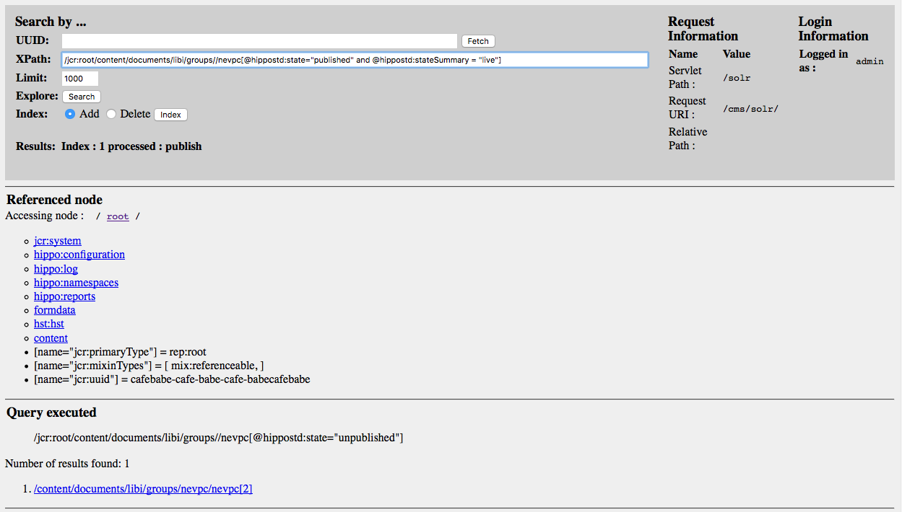

# hippo-solrbulk-servlet

A simple servlet for use with the CMS for searching the Hippo/JCR and sending records to Solr.

## Introduction

Although the Hippo Camel Forge module handles Solr indexing during CMS workflow events, we still need a means for bulk updating Hippo content.  This servlet is built upon Hippo's Repository servlet (available at /cms/repository) and integrates with the forge module's Camel routes.

For more information about Hippo's Camel Forge Plugin, see here: https://forge.onehippo.org/gf/project/camel-hippoevt
Find more information about the library's usage of this plugin in Confluence: TODO

## Sample Screenshot



This demonstrates using XPath to search for the NEVPC group as well as how one might process that record.

## Example Workflow

Perform a search using XPath.

Review those results.  If they come through as expected, you can then choose to "Add" or "Delete" those records from the Solr index.  Select the appropriate radio button and click the Index button.

## Integration with Camel

This servlet uses an endpoint provided by the forge plugin, specifically: file:inbox?autoCreate=true&charset=utf-8, which is defined in the routes-with-file.xml Spring configuration file.

```
  <route id="Route-HippoEventBus-to-File">
    <from uri="hippoevent:?category=workflow&amp;action=publish,depublish" />
    <convertBodyTo type="java.lang.String" />
    <to uri="log:edu.umd.lib.hippo?level=INFO"/>
    <to uri="file:inbox?autoCreate=true&amp;charset=utf-8" />
  </route>
```

## Integration with Hippo

The Solr servlet has been designed to work with Hippo v7.9.*. It may work with other versions, but this has not been tested.

The servlet is intended to work with the Hippo CMS. It consists of a single jar file (hippo-solr-servlet-[VERSION].jar), which can be added to the classpath of the web container in which the CMS runs. The following stanzas should be added to the web.xml file:

```
  <servlet>
    <servlet-name>SolrServlet</servlet-name>
    <servlet-class>edu.umd.lib.servlets.solr.SolrServlet</servlet-class>
    <load-on-startup>7</load-on-startup>
  </servlet>
 
  <servlet-mapping>
    <servlet-name>SolrServlet</servlet-name>
    <url-pattern>/solr/*</url-pattern>
  </servlet-mapping> 
```
Once properly configured, the servlet should be accessible at [CMS URL]/solr. For example, in a local development environment, the URL will likely be http://localhost:8080/cms/solr.

## Integration with a Hippo Build

The Permissions servlet jar file is available from a Nexus repository maintained by the University of Maryland, College Park Library. To access the repository, add the following to your pom.xml file:

```
  <distributionManagement>
    <repository>
      <id>nexus</id>
      <name>Releases</name>
      <url>https://maven.lib.umd.edu/nexus/content/repositories/releases</url>
    </repository>
    <snapshotRepository>
      <id>nexus</id>
      <name>Snapshots</name>
      <url>https://maven.lib.umd.edu/nexus/content/repositories/snapshots</url>
    </snapshotRepository>
  </distributionManagement>
```

The dependency for the servlet is:

```
    <dependency>
      <groupId>edu.umd.lib.servlets</groupId>
      <artifactId>hippo-solr-servlet</artifactId>
      <version>[VERSION]</version>
    </dependency>
```
where [VERSION] is the version number of the servlet to download.

## License

The Solr servlet was created by copying and rewriting the Repository servlet available from Hippo. As such is is available under the Apache License v2.0. See [LICENSE]() for more information.

